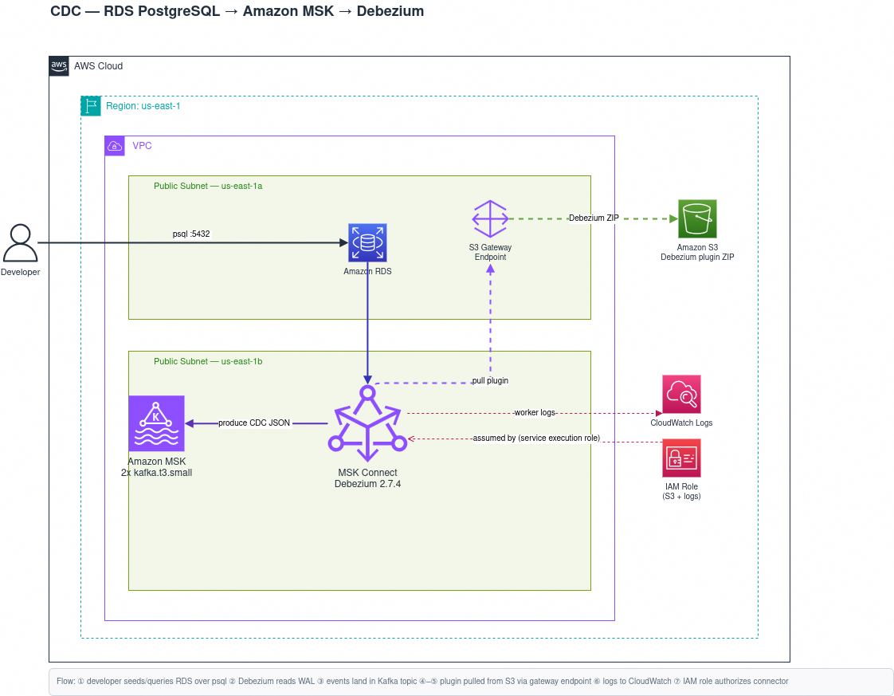

# cdc-infra

Terraform for a **Change Data Capture (CDC) pipeline** on AWS: stream every
INSERT / UPDATE / DELETE from RDS PostgreSQL into Amazon MSK (Kafka) using a
Debezium connector running on MSK Connect — no app code, no polling.

```
┌─────────────┐   WAL    ┌──────────────┐  Kafka topic   ┌─────────────┐
│  RDS        │─────────▶│  Debezium    │───────────────▶│  Consumer   │
│  PostgreSQL │ (logical │  (MSK        │  rds.public.*  │  (any app)  │
│             │  repl.)  │   Connect)   │                │             │
└─────────────┘          └──────────────┘                └─────────────┘
   you write              reads the WAL,                  search index,
   normal SQL             emits 1 event/row change        cache, warehouse…
```

## What is CDC?

Change Data Capture turns a database into a stream of events. Instead of polling
a table asking "what changed?", CDC reads the database's own transaction log (the
PostgreSQL write-ahead log / WAL) and emits one event per row change — with the
operation type (`c` create, `u` update, `d` delete, `r` snapshot read) plus the
before/after row values.

Debezium reads the log; Kafka (MSK) carries the events; any consumer subscribes.
The source database does no extra work beyond what it already writes to its WAL.

### Why it's useful

- Sync DB changes to a search index, cache, or data warehouse in real time
- Append-only audit log of every change ever made
- Event-driven microservices that react to DB changes
- Zero-downtime database migrations and replication

---

## How it all fits together

The pieces are deliberately decoupled — each module hands a value to the next:

1. **`networking`** builds an isolated `10.20.0.0/16` VPC with two public subnets
   (two AZs, because MSK and the RDS subnet group both require multi-AZ). It also
   creates one **self-referencing security group**: anything inside the SG can
   talk to anything else inside the SG, so RDS↔MSK↔Connect "just works" without
   per-port rules. An **S3 gateway endpoint** (free) lets MSK Connect download the
   Debezium plugin without a NAT Gateway.

2. **`iam`** creates the service execution role MSK Connect assumes — scoped to
   read the plugin from S3 and write its worker logs to CloudWatch.

3. **`rds`** provisions PostgreSQL with a custom parameter group that sets
   `rds.logical_replication = 1` (→ `wal_level = logical`). This is the switch
   that makes the WAL readable by Debezium. Without it, no CDC.

4. **`msk`** stands up a `kafka.t3.small` 2-broker cluster, PLAINTEXT, with
   `auto.create.topics.enable = false`.

5. **`msk_connect`** is where the actual CDC engine runs:
   - A `local-exec` provisioner downloads the Debezium Postgres connector tarball
     from Maven, repacks it as a flat ZIP, and uploads it to an S3 bucket.
   - That ZIP is registered as an MSK Connect **custom plugin**.
   - The **connector** runs the plugin against the RDS host + MSK brokers. It
     opens a logical replication slot named `debezium`, auto-creates a Postgres
     publication (`publication.autocreate.mode = filtered`) for the captured
     tables, and streams changes.
   - Because the broker won't auto-create topics, the connector self-creates them
     via Kafka Connect's `topic.creation.*` config (replication factor 2 = broker
     count, 1 partition).

### Wiring (who passes what)

| From → To                 | Value handed over                          |
|---------------------------|--------------------------------------------|
| `networking` → all        | `subnet_ids`, `lab_security_group_id`      |
| `iam` → `msk_connect`     | `service_execution_role_arn`               |
| `rds` → `msk_connect`     | `endpoint` (DB host) + `db_password`       |
| `msk` → `msk_connect`     | `bootstrap_brokers_plaintext`              |

### What you get on the wire

Debezium emits to topics named **`{topic_prefix}.{schema}.{table}`**. With the
defaults (`topic_prefix = "rds"`, `table_include_list = "public.users"`) that's a
single topic `rds.public.users`. A row update looks roughly like:

```json
{
  "op": "u",
  "before": { "id": 7, "email": "old@x.com" },
  "after":  { "id": 7, "email": "new@x.com" },
  "source": { "schema": "public", "table": "users", "lsn": 24034896 }
}
```

---

## Architecture



| Module        | Purpose                                                                 |
|---------------|-------------------------------------------------------------------------|
| `networking`  | Dedicated VPC, 2 public subnets (2 AZs), IGW, self-ref SG, S3 endpoint   |
| `iam`         | MSK Connect service execution role (scoped S3 read + CloudWatch logs)    |
| `rds`         | Parameter group (logical replication) + PostgreSQL instance             |
| `msk`         | `kafka.t3.small` cluster, 2 brokers, PLAINTEXT                           |
| `msk_connect` | Builds + uploads Debezium plugin, registers it, runs the connector      |

## Layout

```
cdc-infra/
├── providers.tf            # AWS provider, default tags
├── variables.tf            # region, project_name, vpc_cidr, db_password, my_ip_cidr
├── main.tf                 # module wiring
├── outputs.tf              # endpoints, brokers, connector name, plugin bucket
├── terraform.tfvars        # secrets (gitignored)
├── terraform.tfvars.example
└── modules/
    ├── networking/         # VPC, subnets, IGW, SG, S3 gateway endpoint
    ├── iam/                # MSK Connect service execution role
    ├── rds/                # parameter group + Postgres instance
    ├── msk/                # Kafka cluster
    └── msk_connect/        # Debezium plugin build + connector
```

## Design notes

- **Dedicated VPC** — nothing touches the account default VPC; `terraform
  destroy` removes everything cleanly.
- **Self-referencing security group** — one SG shared by RDS, MSK, and Connect;
  intra-SG traffic fully allowed. Optional `my_ip_cidr` opens psql (5432) and
  Kafka (9092) to your laptop only.
- **S3 gateway endpoint** — free; lets MSK Connect pull the plugin ZIP without a
  NAT Gateway or internet egress.
- **Logical replication** — set in the RDS parameter group with
  `apply_method = pending-reboot`; the instance must reboot once before the slot
  can be created.
- **`kafka.t3.small`** — smallest MSK broker; the console blocks it, so it must
  be provisioned via API / Terraform.
- **Self-creating topics** — broker has `auto.create.topics.enable = false`, so
  the connector creates topics itself (`topic.creation.*`).
- **Plugin built at apply time** — a `null_resource` + `local-exec` fetches the
  Debezium tarball from Maven; needs `curl`, `tar`, `zip`, and the AWS CLI on the
  machine running Terraform.

---

## Usage

```bash
# One-time
cp terraform.tfvars.example terraform.tfvars   # set db_password (+ my_ip_cidr)
terraform init

# Build / inspect
terraform plan
terraform apply

# Tear down
terraform destroy
```

### After apply — see it work

```bash
# 1. Connect to RDS (needs my_ip_cidr set), make a change
psql -h "$(terraform output -raw rds_endpoint)" -U postgres -d postgres
#   create table users (id serial primary key, email text);
#   insert into users (email) values ('a@x.com');
#   update users set email = 'b@x.com' where id = 1;

# 2. Read the events off Kafka
kafka-console-consumer.sh \
  --bootstrap-server "$(terraform output -raw msk_bootstrap_brokers)" \
  --topic rds.public.users --from-beginning
```

### Variables

| Name           | Default         | Notes                               |
|----------------|-----------------|-------------------------------------|
| `region`       | `us-east-1`     | —                                   |
| `project_name` | `lab`           | prefix for all resource names       |
| `vpc_cidr`     | `10.20.0.0/16`  | CIDR for the dedicated VPC          |
| `my_ip_cidr`   | `""`            | home IP /32 for psql/kafka access   |
| `db_password`  | *(required)*    | RDS master password; set in tfvars  |

---

## Adapting it for other setups

The defaults capture `public.users` into topic `rds.public.users`. Everything you
need to change lives in the `msk_connect` module's variables — wire them through
from the `msk_connect` block in `main.tf`.

| Goal | Change |
|------|--------|
| **Capture different / more tables** | Set `table_include_list` (comma-separated `schema.table`, e.g. `public.users,public.orders`). One topic per table. |
| **Capture a whole schema** | Use a regex, e.g. `table_include_list = "public.*"` (Debezium treats entries as regex). |
| **Rename the topic namespace** | Set `topic_prefix` (e.g. `prod` → `prod.public.users`). |
| **Different database / user** | Set `db_name`, `db_user`, `db_port`. |
| **Newer Debezium** | Bump `plugin_version`; the build step refetches from Maven. The `null_resource` trigger rebuilds + reuploads. |
| **More throughput** | Raise `mcu_count` / `worker_count` in the connector `capacity` block, and topic `partitions`. |
| **Multiple environments** | Change `project_name` (prefixes every resource) and run in a separate workspace / state. |

### Beyond the lab

- **Encryption / auth** — this lab uses PLAINTEXT + `authentication_type = NONE`
  for simplicity. For real use, switch MSK to TLS or IAM auth and update the
  connector's `kafka_cluster_client_authentication` / `encryption_in_transit`.
- **Private subnets + NAT or VPC endpoints** — move RDS/MSK to private subnets;
  the S3 endpoint already keeps plugin downloads private.
- **Schema registry** — swap `JsonConverter` for Avro + Glue/Confluent registry
  if consumers need versioned schemas.

## Roadmap

- [ ] Remote state: S3 backend + native locking
- [ ] GitHub Actions: `plan.yml` (PR), `apply.yml` (merge), `destroy.yml` (manual)
- [ ] OIDC auth for GitHub Actions (no static keys)
